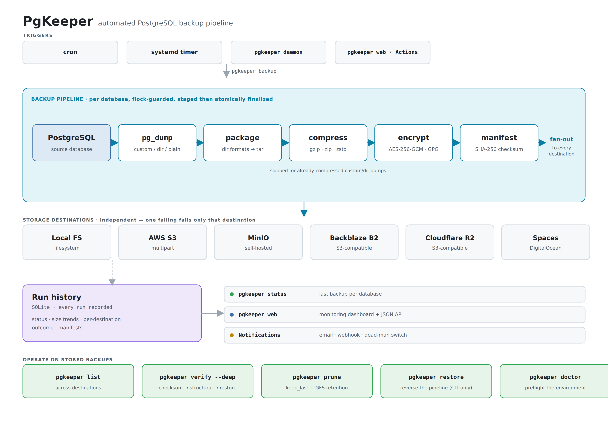
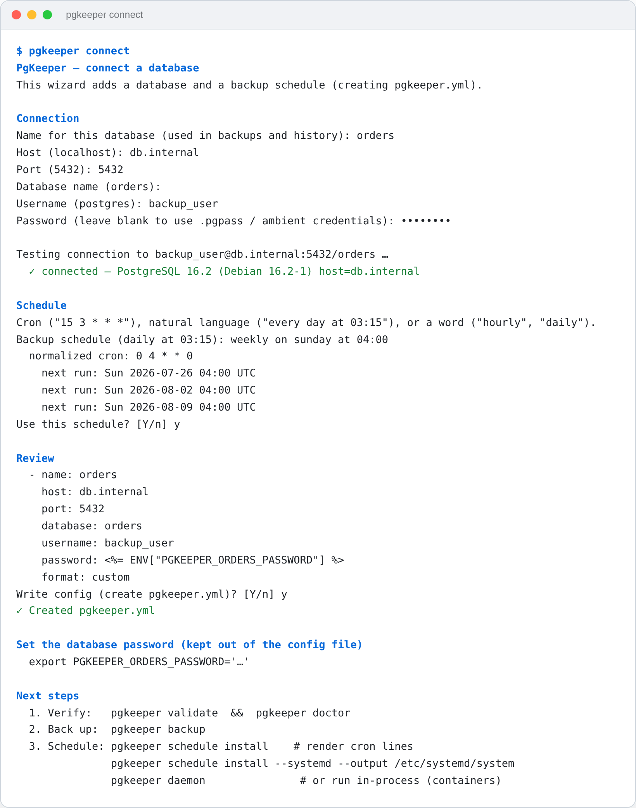
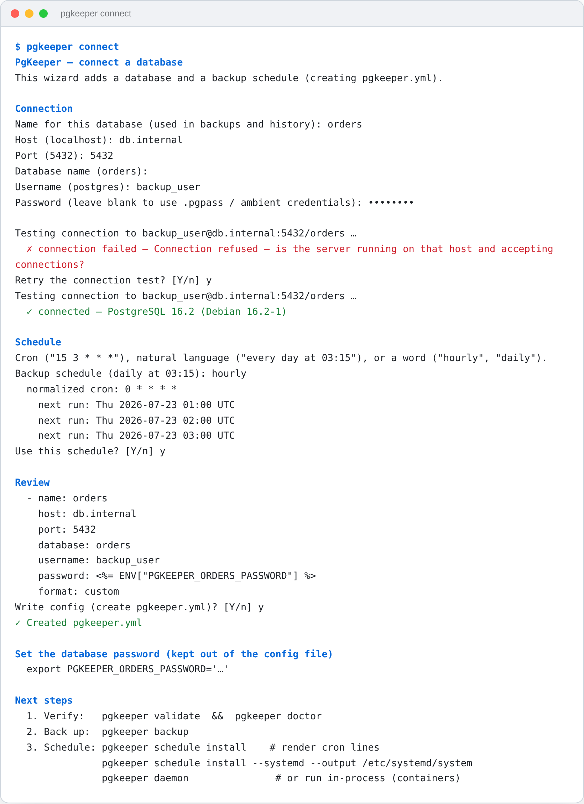
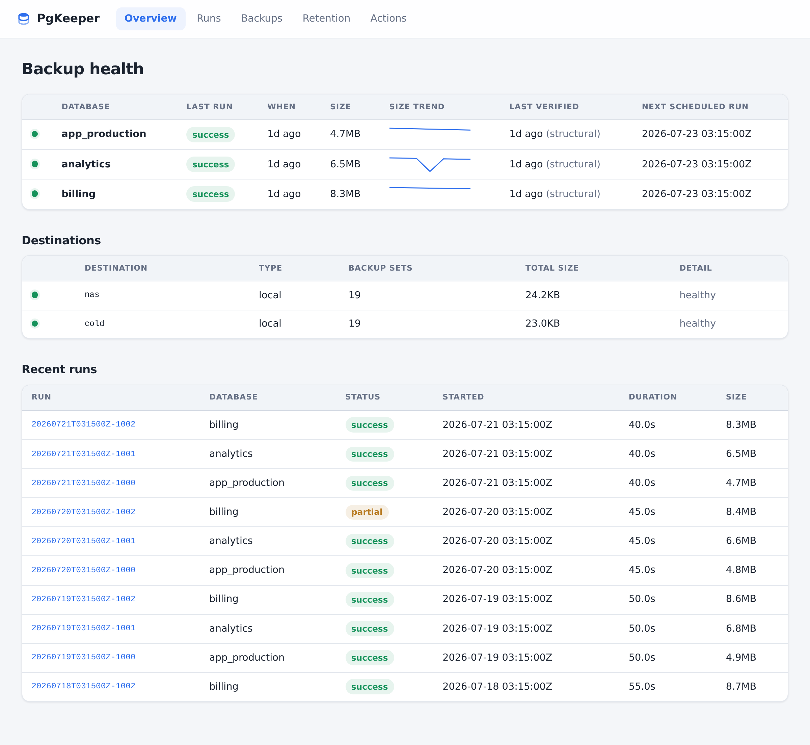
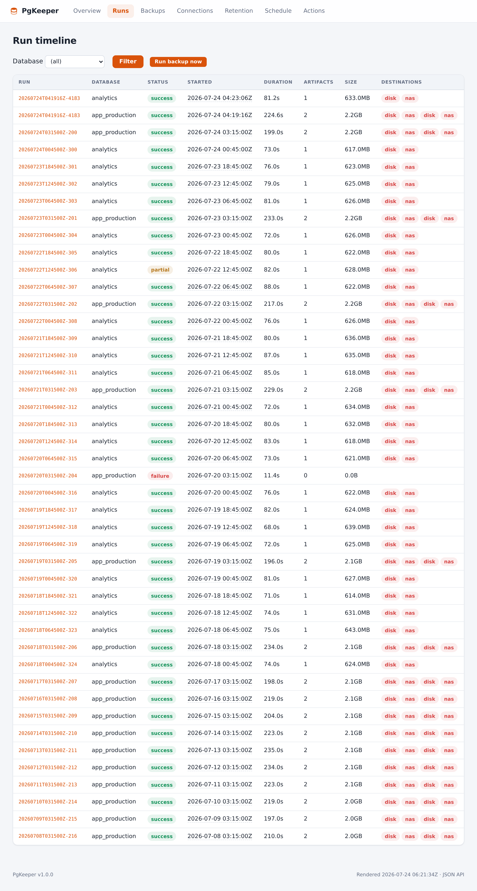
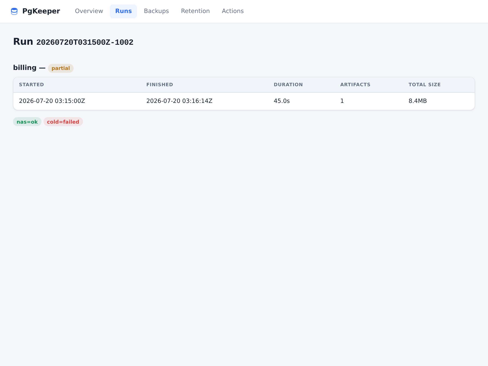
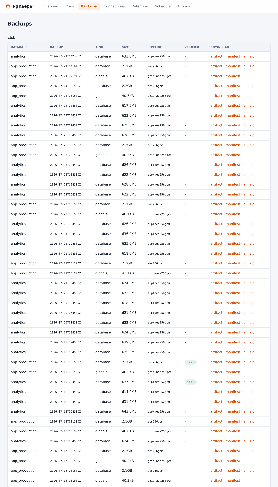
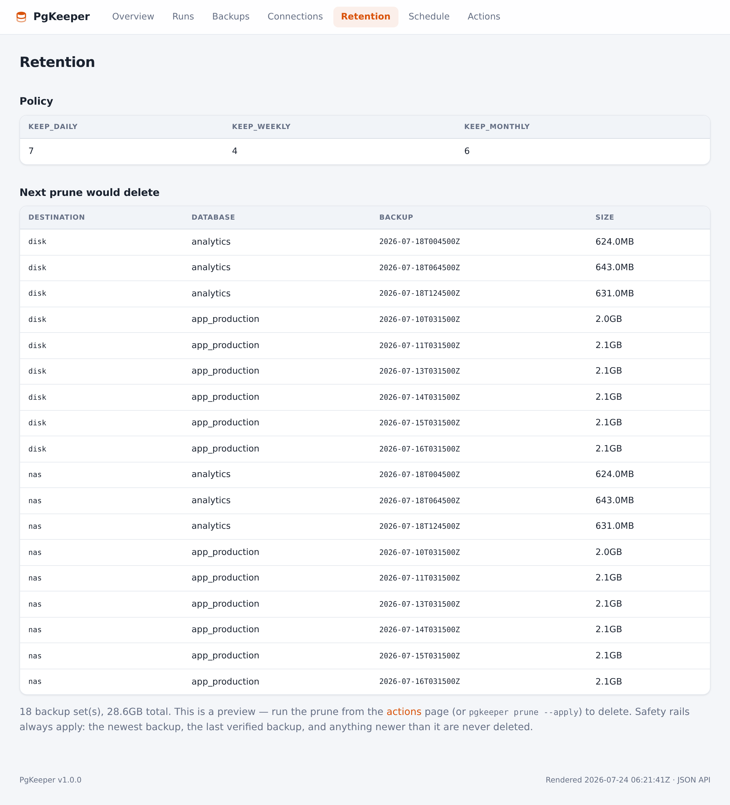
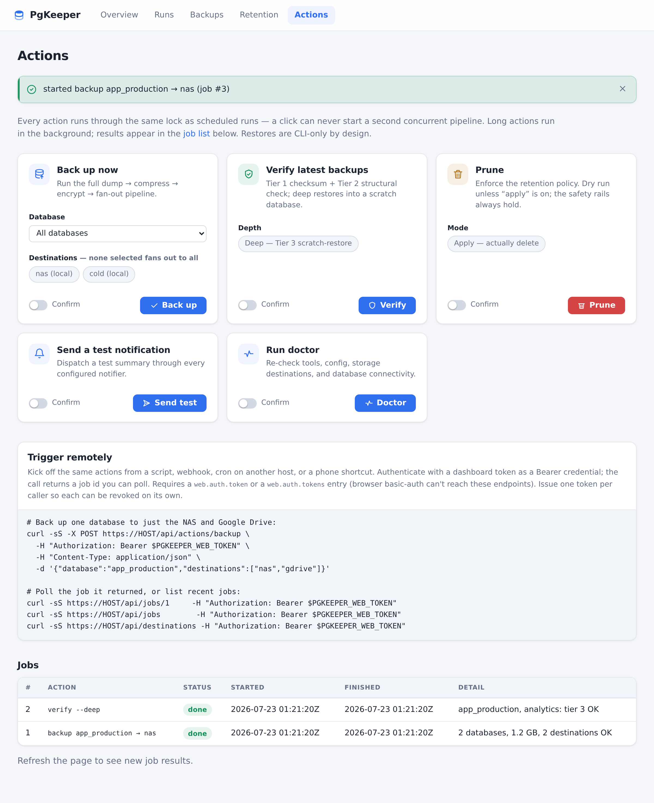

# PgKeeper

A full-fledged, automated PostgreSQL backup solution in Ruby.

PgKeeper dumps your databases on a schedule, compresses and optionally encrypts the
artifacts, stores them locally and/or in the cloud (S3-compatible object storage, Dropbox,
Google Drive, and SharePoint/OneDrive), enforces retention policies, verifies that backups
are actually restorable, reports status via email, and includes an optional web dashboard
(`pgkeeper web`) for monitoring backup health and triggering runs.

**Status:** v1.0 (Phases 0–10) is implemented and tested — backups are compressed,
optionally encrypted, fanned out to multiple destinations, pruned by a retention policy,
**verifiably restorable**, **reported on** (run-history, email/webhook alerts, dead-man's
switch), **scheduled** (cron/systemd installers or a built-in daemon), **observable in a
browser** (`pgkeeper web`), and **deployable with Docker**. See [PLAN.md](PLAN.md) for the
full multi-phase build plan, [CHANGELOG.md](CHANGELOG.md) for what shipped when, and
[docs/RESTORE.md](docs/RESTORE.md) for the restore runbook.

> **Recovery-point boundary (by design, documented):** PgKeeper takes logical dumps —
> there is no WAL archiving / point-in-time recovery, so **your recovery point is your
> last completed dump**: a restore loses everything written since then. Your RPO is
> therefore your backup interval — schedule accordingly. If you need minutes-or-seconds
> RPO, pair PgKeeper with a PITR tool today. See **[docs/RPO-RTO.md](docs/RPO-RTO.md)** for
> how to set an RPO/RTO SLA you can keep; native WAL archiving / PITR is a planned phase
> (PLAN.md Phase 12).

## How it works

A trigger (cron, a systemd timer, the built-in daemon, or a click in the dashboard) starts
`pgkeeper backup`, which runs one pipeline **per database** — `pg_dump` → package →
compress → encrypt → SHA-256 manifest — then **fans the artifact out to every configured
destination** independently. Every run is recorded to a SQLite history that powers
`status`, the dashboard, and notifications, and the lifecycle commands (`list`, `verify`,
`prune`, `restore`, `doctor`) operate on the stored backups.

<p align="center">
  <picture>
    <source media="(prefers-color-scheme: dark)" srcset="docs/images/architecture-dark.png">
    
  </picture>
</p>

## Backup guarantees

An independent engineering review ([docs/ASSESSMENT.md](docs/ASSESSMENT.md)) rates PgKeeper
a production-grade v1 for **scheduled, verifiable, encrypted logical backups with
multi-destination redundancy**. In short:

- **Verifiable** — the standout strength. Three escalating tiers, not a checkbox:
  re-checksum the artifact, prove it's a readable archive, and (`--deep`) actually
  restore it into a throwaway database with strict error handling — so a partially
  corrupt dump *fails* verification instead of passing. A verified backup is also
  protected from pruning. _A backup you have never restored is not a backup._
- **Secure** — AES-256-GCM authenticated encryption **before** upload (clouds never see
  plaintext), **key rotation** through a keyring so retiring a passphrase never strands the
  backups written under it, secrets kept in the environment (never inlined), and a dashboard
  that refuses to boot without auth, compares credentials in constant time, binds to
  `127.0.0.1`, gates every mutating action behind CSRF, and keeps restores CLI-only.
- **Predictable** — flock-guarded runs, staging + atomic finalize (a crash never leaves a
  half-written backup), wall-clock timeouts on every child process, a disk preflight that
  refuses a dump it can't fit, pinned dependencies (`Gemfile.lock`), and backup-size
  anomaly detection that flags a silently-shrinking dump.
- **Redundant & assured** — independent fan-out to multiple destinations (one outage fails
  only that destination), retention safety rails that never delete your only or newest
  backup, optional **S3 Object Lock (WORM)** so a leaked credential or a rogue `prune` can't
  delete a backup before it expires, plus a dead-man's switch, notifications, and Prometheus
  metrics.

**Know the boundary:** PgKeeper takes logical dumps, **not** point-in-time recovery — your
recovery point is your last completed dump, so your RPO is your backup interval. See
[docs/RPO-RTO.md](docs/RPO-RTO.md) to set a recovery SLA you can keep, and pair with a PITR
tool if you need minutes-or-seconds RPO.

## What works today

- **`pgkeeper connect`** — an interactive onboarding wizard that connects a database and
  schedules its backups. It collects the connection details, **live-tests the credentials**
  against the server, takes a backup schedule (validated, with a preview of the next few
  runs), and writes `pgkeeper.yml` — generating a fresh commented config on a new host, or
  appending to an existing one **without disturbing its comments or `<%= ENV[...] %>`
  interpolations**. Passwords are stored as an env-var reference, never inlined.
- **`pgkeeper doctor`** — checks that `pg_dump`/`pg_restore`/`pg_dumpall`/`psql` are on
  PATH, validates your config, health-checks every storage destination, confirms each
  database is reachable, and warns on `pg_dump`-vs-server version drift.
- **`pgkeeper validate`** — loads the config and reports every schema problem at once.
- **`pgkeeper backup`** — for each database, runs the full pipeline:

      pg_dump → package (directory formats) → compress → encrypt → manifest
              → fan out to every configured destination

  - **Compression:** gzip, zip, or zstd; skipped automatically for already-compressed
    `custom`/`directory` dumps.
  - **Encryption at rest:** AES-256-GCM (built in) or GPG, keyed by passphrase or keyfile;
    tamper-evident, and reversed transparently on restore.
  - **Storage fan-out:** local filesystem (including a mounted NAS/SMB/NFS share),
    S3-compatible object storage (AWS S3, MinIO, Backblaze B2, Cloudflare R2, Spaces),
    Dropbox, Google Drive, and SharePoint/OneDrive. Destinations are independent — one
    being down fails only that destination, and the report shows per-destination status.
  - **Destination selection:** give any destination a friendly `name:` and scope a single
    run to a subset with `pgkeeper backup --destinations nas,gdrive` (default is all).
    `pgkeeper destinations` lists the selectable tokens.
  - Cluster globals (`pg_dumpall --globals-only`), a SHA-256 manifest per artifact,
    flock-guarded runs, and staging + atomic finalize so a crash never leaves a
    half-written backup.
  - **Wall-clock timeouts** on every `pg_dump`/`pg_restore`/`psql` call
    (configurable `timeouts:`), so a hung child can't block a run forever, and
    **backup-size anomaly detection** that warns loudly when a dump is suddenly
    far smaller than its recent history — the classic silently-broken-dump
    signal — in the CLI, the log, and the run's notification.
- **`pgkeeper list`** — lists backups across every destination with size, age, the
  compression/encryption pipeline, and verification status.
- **`pgkeeper prune`** — enforces the retention policy (`keep_last` and/or GFS
  daily/weekly/monthly/yearly), per destination and per database. Dry-run by default;
  `--apply` to delete. Safety rails: never deletes the newest backup, never prunes to
  zero, never deletes the last verified backup or anything newer than it.
- **`pgkeeper verify [--deep]`** — Tier 1 re-checksums the artifact, Tier 2 proves it's a
  readable archive (`pg_restore --list` / non-empty SQL), and `--deep` restores it into a
  throwaway scratch database. Passing marks the backup verified.
- **`pgkeeper restore`** — fetches a backup from a destination, reverses the
  encryption + compression pipeline, and restores into a target database via
  `pg_restore`/`psql`. Overwriting a non-empty database requires `--force`. See
  [docs/RESTORE.md](docs/RESTORE.md).
- **`pgkeeper status`** — reads the SQLite run-history and shows the most recent backup
  per database (status, age, size), or recent runs for one database with `--database`.
- **`pgkeeper metrics`** — prints Prometheus metrics from the run-history for scraping;
  `--output FILE` writes an atomic textfile for the node_exporter textfile collector.
- **Notifications** (fired automatically after each run, and testable with
  `pgkeeper test-notification`): **email** (SMTP+TLS, HTML+text, success/failure
  triggers), a generic/Slack **webhook**, and a **dead-man's-switch** ping so a monitor
  catches a cron that silently never ran. Notifier failures are logged and never affect
  the backup itself.
- **Scheduling** — set a `schedule:` (cron, natural language, or shorthands like
  `daily at 03:15`), globally or per-database — interactively via `pgkeeper connect` or by
  hand. A `maintenance:` block schedules the upkeep jobs too — **`verify` (with `--deep`)
  and `prune`** — so verification and retention run unattended like the backup itself, not
  as forgotten hand-wired cron lines. `pgkeeper schedule install` emits
  **flock-guarded crontab lines** or **systemd service+timer units** (with
  `RandomizedDelaySec` stagger and `Persistent=true` catch-up), one per job;
  `pgkeeper schedule print` shows the resolved plan. For containers without cron/systemd,
  `pgkeeper daemon` runs every schedule in-process with jitter.

- **`pgkeeper web`** — the optional monitoring dashboard:
  - **Overview**: per-database traffic lights (last run, last verified age, next scheduled
    run), size-trend sparklines that make a suddenly-smaller dump visible, and a
    per-destination health grid.
  - **Runs**: timeline of every recorded run with a detail page per run (duration,
    per-destination status, stderr on failures).
  - **Retention**: the policy and exactly what the next prune would delete.
  - **Backups**: browse artifacts across destinations and download them (allowlisted
    against the catalog — the endpoint can't be steered at arbitrary paths).
  - **Actions**: trigger backup / verify / prune / test-notification / doctor from the
    browser, and pick which destinations a backup targets. Every action needs a CSRF token
    plus an explicit confirmation, and runs through the same lock as cron — never a second
    concurrent pipeline. Restores are deliberately CLI-only.
  - **Remote-trigger API**: token-authenticated `POST /api/actions/{backup,verify,prune}`
    kicks off the same jobs from a script, webhook, or phone shortcut — choosing databases
    and destinations per call — and returns a job id to poll at `GET /api/jobs/<id>`. Issue
    a **revocable token per caller** (`web.auth.tokens`) and each action is logged with the
    caller's name. See [docs/REMOTE-API.md](docs/REMOTE-API.md).
  - **JSON API & metrics**: `/api/status`, `/api/runs`, and `/api/destinations` for
    external monitors, plus a Prometheus `/metrics` endpoint (last run/success timestamp,
    backup size, duration, success per database). Unauthenticated `/healthz` and
    `/readyz` probes sit outside auth for container orchestrators.
  - **Security**: auth is mandatory (constant-time token or basic auth), it binds to
    `127.0.0.1` by default, and it reads the same run-history/manifests the CLI writes —
    no second data path. Needs the optional `rack` + `puma` gems; see the `web:` block in
    the example config and [docs/SECURITY.md](docs/SECURITY.md).

Meaningful exit codes throughout: `0` success, `1` partial (some destinations/databases
failed), `2` total failure. Every run is recorded to a SQLite history store that powers
`status` and the dashboard.

Storage adapters share one contract (upload / download / list / delete / healthcheck with
retry + backoff), so local, S3, and the in-memory test backend are provably
interchangeable. Cloud SDKs are optional dependencies, lazy-loaded only when used.

## Onboarding

`pgkeeper connect` is the guided way in: it collects a database's connection details,
**live-tests them against the server**, takes a validated backup schedule (with a preview
of the next few runs), and writes `pgkeeper.yml` — a fresh commented config on a new host,
or an appended entry on an existing one (comments and `<%= ENV[...] %>` interpolations
preserved). Passwords are stored as an env-var reference, never inlined.

<p align="center">
  <picture>
    <source media="(prefers-color-scheme: dark)" srcset="docs/images/wizard-connect-dark.png">
    
  </picture>
</p>

The credential test is a real `psql` round-trip (the same check `pgkeeper doctor` runs), so
a typo or an unreachable server is caught up front — retry, save anyway, or abort:

<p align="center">
  <picture>
    <source media="(prefers-color-scheme: dark)" srcset="docs/images/wizard-connect-retry-dark.png">
    
  </picture>
</p>

## The dashboard

`pgkeeper web` serves a read-mostly monitoring UI over the **same** run-history and
manifests the CLI writes — no second data path. Auth is mandatory, it binds to `127.0.0.1`
by default, and every mutating action runs through the same lock as cron.

> _Screenshots below use representative sample data._

**Overview** — per-database traffic lights (last run, last-verified age, next scheduled
run), size-trend sparklines that make a suddenly-smaller dump visible, and a
per-destination health grid:



**Runs** — a timeline of every recorded run, each linking to a detail page with
per-destination status and stderr on failures:





**Backups** — browse artifacts across destinations, with the compression/encryption
pipeline and verification tier per artifact; downloads are allowlisted against the catalog:



**Retention** — the active policy and exactly what the next prune would delete (a preview;
the safety rails always apply):



**Actions** — trigger backup / verify / prune / test-notification / doctor from the
browser; each needs a CSRF token plus an explicit confirmation. Restores are deliberately
CLI-only:



## Stack

- Ruby 4 (toolchain pinned with [mise](https://mise.jdx.dev); see `.mise.toml`)
- Gem-packaged CLI built on `thor`
- `pg_dump` / `pg_restore` under the hood (never reimplemented)
- Minitest for testing — unit tests plus Dockerized/live-Postgres integration tests

## Getting started

```sh
# 1. Provision the pinned Ruby toolchain and install dependencies.
mise install
mise exec -- bundle install

# 2. Write a config — either run the onboarding wizard (it tests the connection,
#    sets a schedule, and writes pgkeeper.yml) ...
mise exec -- ruby -Ilib bin/pgkeeper connect -c pgkeeper.yml
export PGKEEPER_ORDERS_PASSWORD=...     # the wizard prints the exact var to set

#    ... or copy the annotated example and edit it by hand.
# cp config/pgkeeper.example.yml pgkeeper.yml
# export PGKEEPER_APP_PASSWORD=...      # secrets come from the environment

# 3. Check the environment, then take a backup.
mise exec -- ruby -Ilib bin/pgkeeper doctor  -c pgkeeper.yml
mise exec -- ruby -Ilib bin/pgkeeper backup  -c pgkeeper.yml
mise exec -- ruby -Ilib bin/pgkeeper list    -c pgkeeper.yml
```

Config is a single declarative YAML file with ERB interpolation for secrets, so
passwords stay in the environment and out of git:

```yaml
databases:
  - name: app_production
    host: db.internal
    username: backup_user
    password: <%= ENV["PGKEEPER_APP_PASSWORD"] %>
    format: custom
    include_globals: true
storage:
  - type: local
    path: /var/backups/pgkeeper/backups
```

See [`config/pgkeeper.example.yml`](config/pgkeeper.example.yml) for the full annotated
schema.

## Docker

The image bundles the CLI, the scheduling daemon, and the dashboard (plus the
S3 SDK and `postgresql-client`):

```sh
docker build -t pgkeeper .
docker run --rm -v ./pgkeeper.yml:/etc/pgkeeper/pgkeeper.yml:ro pgkeeper doctor

# Daemon + dashboard together, wired next to a database:
cp docker-compose.example.yml docker-compose.yml   # then edit
export POSTGRES_PASSWORD=... PGKEEPER_APP_PASSWORD=... PGKEEPER_WEB_TOKEN=...
docker compose up -d
```

## Documentation

- [docs/USAGE.md](docs/USAGE.md) — **the full usage guide**: install, configure,
  every command, scheduling, dashboard, Docker, library use, troubleshooting.
- [docs/SCHEDULING.md](docs/SCHEDULING.md) — scheduling automated jobs (backup, verify,
  prune) via cron, systemd timers, or the built-in daemon, with the generated output.
- [docs/RPO-RTO.md](docs/RPO-RTO.md) — data-loss/recovery-time expectations and how
  to set an SLA you can keep.
- [docs/ASSESSMENT.md](docs/ASSESSMENT.md) — engineering review of the backup
  guarantees (verifiable, secure, predictable) and where the boundaries are.
- [docs/RESTORE.md](docs/RESTORE.md) — the 3 a.m. restore runbook.
- [docs/SECURITY.md](docs/SECURITY.md) — least-privilege backup role, secrets,
  encryption, dashboard hardening.
- [docs/PROVIDERS.md](docs/PROVIDERS.md) — storage setup for AWS S3, MinIO,
  Backblaze B2, Cloudflare R2, Spaces, Dropbox, Google Drive, SharePoint/OneDrive.
- [docs/REMOTE-API.md](docs/REMOTE-API.md) — triggering backups remotely and
  selecting destinations, from the CLI, the web API, and the dashboard.
- [CHANGELOG.md](CHANGELOG.md) — release history mapped to plan phases.

## Development

```sh
mise exec -- bundle exec rake test        # unit + integration (integration skips w/o PG)
mise exec -- bundle exec rake test:unit   # fast, hermetic unit tests only
mise exec -- bundle exec rake lint        # RuboCop
```

Integration tests run against a live Postgres when the `PGKEEPER_TEST_PG*` environment
variables point at one (CI supplies a `postgres:16` service container); otherwise they
skip, keeping the unit suite hermetic.
